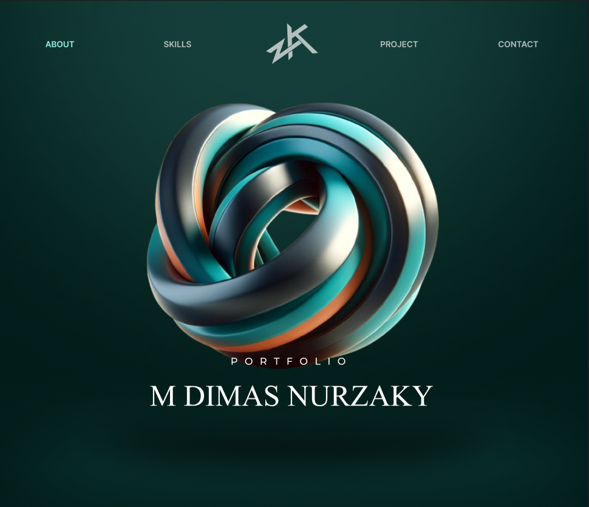

# 🌟 Portfolio Website - M Dimas Nurzaky (Kuwuk)

Portfolio website modern dengan efek 3D interaktif menggunakan React, TypeScript, Three.js, dan Tailwind CSS.

## 🚀 Tech Stack

- **Frontend Framework:** React 18 + TypeScript
- **3D Rendering:** Three.js + React Three Fiber
- **Styling:** Tailwind CSS v3
- **Animations:** Framer Motion
- **Icons:** React Icons
- **Build Tool:** Vite
- **Deployment:** Netlify / Vercel ready

## ✨ Features

### 🎨 Hero Section with 3D Graphics

- Interactive 3D Torus Knot dengan Three.js
- Auto-rotating dengan mouse interaction
- Smooth parallax effects
- Gradient lighting system

### 📝 About Section

- Professional profile showcase
- Skill tags dengan hover effects
- CV download button
- Glassmorphism design elements

### 🎯 Skills Section

- Icon-based skill visualization
- Categorized by: Frontend, Backend, Tools, Design
- Animated skill level bars
- Hover effects dengan micro-interactions

### 💼 Projects Section

- Grid layout responsive (3 columns → 2 → 1)
- Project cards dengan hover effects
- Tech stack badges
- Live demo & GitHub links
- Image overlay effects

### 📧 Contact Section

- Interactive contact form
- EmailJS integration ready
- Form validation
- Success/error notifications
- Social media links

### 🌓 Dark/Light Mode

- Theme toggle dengan smooth transitions
- Persistent theme (localStorage)
- Optimized color schemes untuk both modes

### 🎭 Animations

- Framer Motion untuk page transitions
- Scroll-triggered animations
- Hover & tap interactions
- Floating scroll indicator

### 🤖 AI Chatbot Assistant

- Floating chat button di pojok kanan bawah
- Interactive chat panel dengan glassmorphism design
- Predefined responses untuk pertanyaan umum
- Smart navigation ke section tertentu
- Chat history dengan typing indicator
- Responsive design untuk mobile & desktop

## 📁 Project Structure

\`\`\`
Portfolio/
├── public/
│ └── vite.svg
├── src/
│ ├── components/
│ │ ├── About.tsx # About section
│ │ ├── Contact.tsx # Contact form & info
│ │ ├── Footer.tsx # Footer with social links
│ │ ├── Hero.tsx # Hero section
│ │ ├── Navbar.tsx # Navigation bar
│ │ ├── Projects.tsx # Projects showcase
│ │ ├── Scene3D.tsx # Three.js 3D scene
│ │ └── Skills.tsx # Skills visualization
│ ├── context/
│ │ ├── ThemeContext.tsx # Theme provider
│ │ └── useTheme.ts # Theme hook
│ ├── data/
│ │ ├── projects.ts # Projects data
│ │ └── skills.ts # Skills data
│ ├── App.tsx # Main app component
│ ├── main.tsx # Entry point
│ └── index.css # Global styles + Tailwind
├── index.html
├── package.json
├── tailwind.config.js
├── tsconfig.json
└── vite.config.ts
\`\`\`

## 🛠️ Installation & Setup

### Prerequisites

- Node.js 16+
- npm or yarn

### Installation Steps

1. **Clone atau navigate ke project directory:**
   \`\`\`bash
   cd Portfolio
   \`\`\`

2. **Install dependencies:**
   \`\`\`bash
   npm install
   \`\`\`

3. **Start development server:**
   \`\`\`bash
   npm run dev
   \`\`\`

4. **Open browser:**
   \`\`\`
   http://localhost:5173
   \`\`\`

## 📝 Configuration

### 1. Personal Information

Edit file komponen untuk update informasi personal:

**src/components/Hero.tsx:**
\`\`\`tsx

<h1>M DIMAS NURZAKY</h1>

Web Developer | ML Enthusiast

\`\`\`

**src/components/About.tsx:**

- Update foto profil (ganti URL image)
- Edit deskripsi personal
- Tambah/hapus skill tags

### 2. Projects Data

Edit **src/data/projects.ts:**
\`\`\`tsx
export const projects: Project[] = [
{
id: 1,
title: "Your Project",
description: "Project description",
image: "project-image-url",
techStack: ["React", "Node.js"],
liveUrl: "https://...",
githubUrl: "https://github.com/..."
},
// Add more projects...
];
\`\`\`

### 3. Skills Data

Edit **src/data/skills.ts:**
\`\`\`tsx
export const skills: Skill[] = [
{
name: 'React',
icon: FaReact,
level: 90,
category: 'frontend'
},
// Add more skills...
];
\`\`\`

### 4. Contact Form (EmailJS)

Uncomment dan setup EmailJS di **src/components/Contact.tsx:**

\`\`\`tsx
// 1. Sign up at https://www.emailjs.com/
// 2. Get your credentials
// 3. Replace in handleSubmit:

emailjs.send(
'YOUR_SERVICE_ID',
'YOUR_TEMPLATE_ID',
formData,
'YOUR_PUBLIC_KEY'
)
\`\`\`

### 5. Social Media Links

Edit **src/components/Footer.tsx:**
\`\`\`tsx
const socialLinks = [
{ icon: FiGithub, href: 'https://github.com/your-username' },
{ icon: FiLinkedin, href: 'https://linkedin.com/in/your-username' },
// ...
];
\`\`\`

### 6. Theme Colors

Customize di **tailwind.config.js:**
\`\`\`js
colors: {
primary: {
DEFAULT: '#1a4d4d', // Main color
dark: '#0f2e2e', // Darker shade
light: '#2d7a7a', // Lighter shade
},
secondary: {
DEFAULT: '#5dd3d3', // Accent color
// ...
},
}
\`\`\`

## 🚀 Deployment

### Vercel Deployment

\`\`\`bash

# Install Vercel CLI

npm i -g vercel

# Deploy

vercel
\`\`\`

### Netlify Deployment

\`\`\`bash

# Build project

npm run build

# Drag & drop 'dist' folder ke Netlify

# Or use Netlify CLI

\`\`\`

### Build Command

\`\`\`bash
npm run build
\`\`\`

Output akan ada di folder **dist/**

## 🎨 Customization Tips

1. **3D Object:** Edit `src/components/Scene3D.tsx` untuk ganti objek 3D
2. **Animations:** Adjust timing di Framer Motion props
3. **Color Scheme:** Update Tailwind config untuk brand colors
4. **Fonts:** Ganti font di `src/index.css` (Google Fonts)

## 📱 Responsive Breakpoints

- **Mobile:** < 768px (1 column)
- **Tablet:** 768px - 1024px (2 columns)
- **Desktop:** > 1024px (3 columns)

## 🐛 Troubleshooting

### Three.js not rendering?

- Pastikan WebGL enabled di browser
- Check console untuk errors
- Try different browser

### Animations not smooth?

- Reduce number of particles di Scene3D
- Disable shadows untuk better performance
- Use `will-change` CSS property

### Tailwind classes not working?

- Run `npm run dev` ulang
- Check tailwind.config.js paths
- Verify PostCSS config

## 📄 License

MIT License - Feel free to use for your own portfolio!

## 📚 Additional Documentation

- 📖 **[CHATBOT.md](./CHATBOT.md)** - Dokumentasi lengkap fitur chatbot
- 📖 **[CHATBOT_GUIDE.md](./CHATBOT_GUIDE.md)** - Quick start guide untuk chatbot
- 📖 **[DEPLOYMENT.md](./DEPLOYMENT.md)** - Panduan deployment ke Vercel/Netlify

## 🤝 Contributing

Contributions welcome! Feel free to submit issues or pull requests.

## 💬 Contact

- **Email:** dimas@example.com
- **GitHub:** [@kuwuk](https://github.com/kuwuk)
- **LinkedIn:** [M Dimas Nurzaky](https://linkedin.com/in/kuwuk)

---

Made with ❤️ by M Dimas Nurzaky
